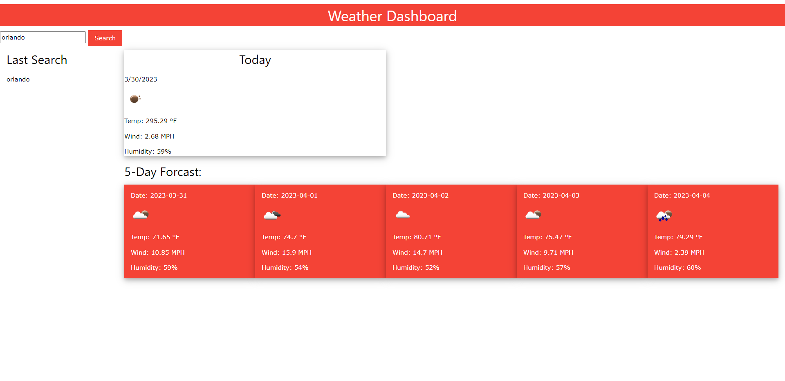

# Weather Dashboard

## Summary 
The application utlizes a weather API to track what the forcast will be within the next 5 days of any location you enter into the search bar

## Screenshots

## Links 
Github: https://github.com/danielgregoire34/gregoire-daniel-module6

Website:https://danielgregoire34.github.io/gregoire-daniel-module6/

## License
This application is under the MIT License.
